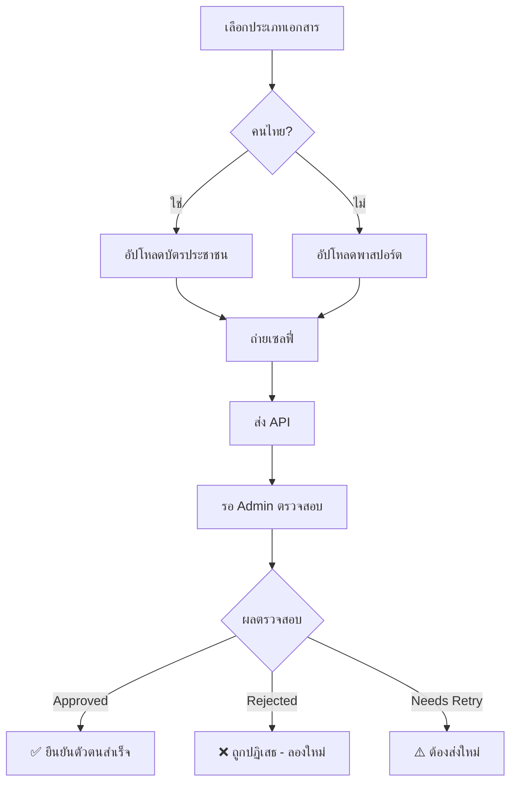

# 🔐 Face Verification with Passport Support - Frontend Integration Guide

**Last Updated:** November 21, 2025  
**API Version:** v1.0 with Passport Support  
**Breaking Changes:** ⚠️ YES - `national_id_doc_id` เปลี่ยนเป็น `document_id` + `document_type`

---

## 📋 Table of Contents

1. [Overview](#overview)
2. [Breaking Changes](#breaking-changes)
3. [API Endpoints](#api-endpoints)
4. [Request/Response Examples](#request-response-examples) 
5. [React Implementation](#react-implementation)
6. [Validation Rules](#validation-rules)
7. [Error Handling](#error-handling)
8. [Testing Checklist](#testing-checklist)

---

## 🎯 Overview

ระบบ Face Verification ตอนนี้รองรับ**ทั้งบัตรประชาชนไทยและพาสปอร์ตต่างชาติ**แล้ว

### Supported Document Types

| Document Type | Value | Used By | Required Fields |
|--------------|-------|---------|-----------------|
| บัตรประชาชนไทย | `"national_id"` | ผู้ให้บริการคนไทย | `document_id`, `selfie_url` |
| พาสปอร์ต | `"passport"` | ผู้ให้บริการชาวต่างชาติ | `document_id`, `selfie_url`, `liveness_video_url` (แนะนำ) |

### User Flow



---

## ⚠️ Breaking Changes

### ❌ OLD API (Before Nov 21, 2025)

```javascript
// ไม่สามารถใช้ได้แล้ว
const requestBody = {
  selfie_url: "https://...",
  national_id_doc_id: 123  // ❌ Field นี้ถูกลบออก
};
```

### ✅ NEW API (After Nov 21, 2025)

```javascript
// ต้องใช้ format นี้
const requestBody = {
  selfie_url: "https://...",
  document_id: 123,           // ✅ ใช้แทน national_id_doc_id
  document_type: "national_id" // ✅ ต้องระบุประเภทเอกสาร
};
```

### Migration Checklist

- [ ] เปลี่ยน `national_id_doc_id` เป็น `document_id`
- [ ] เพิ่ม `document_type` field
- [ ] อัปเดต Form Validation
- [ ] อัปเดต TypeScript interfaces
- [ ] ทดสอบทั้ง national_id และ passport flow
- [ ] อัปเดต Error Messages

---

## 🔌 API Endpoints

### Base URL
```
https://api.skillmatch.com
# หรือ
http://localhost:8080 (development)
```

### Authentication
```javascript
headers: {
  'Authorization': 'Bearer YOUR_JWT_TOKEN',
  'Content-Type': 'application/json'
}
```

---

## 📤 1. Submit Face Verification (Provider)

### Endpoint
```
POST /provider/face-verification
```

### Authorization
- **Required**: ✅ JWT Bearer Token
- **Role**: Provider only

### Request Body

#### TypeScript Interface
```typescript
interface FaceVerificationRequest {
  selfie_url: string;              // Required: URL ของรูปเซลฟี่
  liveness_video_url?: string;     // Optional: URL ของวิดีโอ liveness check
  document_id: number;             // Required: ID ของเอกสาร (จาก provider_documents)
  document_type: 'national_id' | 'passport'; // Required: ประเภทเอกสาร
}
```

#### Example: Thai Provider (บัตรประชาชน)
```javascript
const submitFaceVerification = async (selfieUrl, documentId) => {
  const response = await fetch('https://api.skillmatch.com/provider/face-verification', {
    method: 'POST',
    headers: {
      'Authorization': `Bearer ${token}`,
      'Content-Type': 'application/json'
    },
    body: JSON.stringify({
      selfie_url: selfieUrl,
      document_id: documentId,
      document_type: 'national_id'
    })
  });
  
  return await response.json();
};
```

#### Example: Foreign Provider (พาสปอร์ต)
```javascript
const submitFaceVerification = async (selfieUrl, livenessVideoUrl, documentId) => {
  const response = await fetch('https://api.skillmatch.com/provider/face-verification', {
    method: 'POST',
    headers: {
      'Authorization': `Bearer ${token}`,
      'Content-Type': 'application/json'
    },
    body: JSON.stringify({
      selfie_url: selfieUrl,
      liveness_video_url: livenessVideoUrl, // แนะนำให้มีสำหรับชาวต่างชาติ
      document_id: documentId,
      document_type: 'passport'
    })
  });
  
  return await response.json();
};
```

### Response (201 Created)

```typescript
interface FaceVerificationResponse {
  message: string;
  verification_id: number;
  status: 'pending';
  next_step: string;
}
```

```json
{
  "message": "Face verification submitted successfully",
  "verification_id": 456,
  "status": "pending",
  "next_step": "Admin will review your face verification"
}
```

### Error Responses

#### 400 Bad Request - Invalid Request
```json
{
  "error": "Invalid request",
  "details": "Key: 'document_type' Error:Field validation for 'document_type' failed on the 'oneof' tag"
}
```

#### 404 Not Found - Document Not Found
```json
{
  "error": "เอกสารบัตรประชาชนไม่พบ"
}
// OR
{
  "error": "เอกสารพาสปอร์ตไม่พบ"
}
```

#### 500 Internal Server Error
```json
{
  "error": "Failed to submit face verification"
}
```

---

## 📥 2. Get Face Verification Status (Provider)

### Endpoint
```
GET /provider/face-verification
```

### Authorization
- **Required**: ✅ JWT Bearer Token
- **Role**: Provider only

### Request
```javascript
const getVerificationStatus = async () => {
  const response = await fetch('https://api.skillmatch.com/provider/face-verification', {
    method: 'GET',
    headers: {
      'Authorization': `Bearer ${token}`
    }
  });
  
  return await response.json();
};
```

### Response (200 OK)

#### TypeScript Interface
```typescript
interface FaceVerificationStatus {
  verification_id: number;
  user_id: number;
  selfie_url: string;
  liveness_video_url?: string | null;
  match_confidence?: number | null;    // 0-100
  is_match: boolean;
  national_id_photo_url?: string | null;
  liveness_passed: boolean;
  liveness_confidence?: number | null;  // 0-100
  verification_status: 'pending' | 'approved' | 'rejected' | 'needs_retry';
  api_provider?: string | null;
  created_at: string;                   // ISO 8601
  verified_at?: string | null;          // ISO 8601
  verified_by?: number | null;
  rejection_reason?: string | null;
  retry_count: number;
  document_type: 'national_id' | 'passport'; // ← NEW
  document_id?: number | null;               // ← NEW
}
```

#### Example Response
```json
{
  "verification_id": 456,
  "user_id": 123,
  "selfie_url": "https://storage.googleapis.com/skillmatch/selfies/user123.jpg",
  "liveness_video_url": "https://storage.googleapis.com/skillmatch/liveness/user123.mp4",
  "match_confidence": 85.5,
  "is_match": true,
  "national_id_photo_url": "https://storage.googleapis.com/skillmatch/docs/national_id_123.jpg",
  "liveness_passed": true,
  "liveness_confidence": 92.3,
  "verification_status": "approved",
  "api_provider": "mock_api",
  "created_at": "2025-11-21T10:00:00Z",
  "verified_at": "2025-11-21T10:30:00Z",
  "verified_by": 1,
  "rejection_reason": null,
  "retry_count": 0,
  "document_type": "national_id",
  "document_id": 123
}
```

### Error Responses

#### 404 Not Found - No Verification
```json
{
  "error": "No face verification found"
}
```

---

## 📊 3. List All Face Verifications (Admin)

### Endpoint
```
GET /admin/face-verifications?status=pending
```

### Authorization
- **Required**: ✅ JWT Bearer Token
- **Role**: Admin only

### Query Parameters

| Parameter | Type | Default | Options | Description |
|-----------|------|---------|---------|-------------|
| `status` | string | `pending` | `pending`, `approved`, `rejected`, `needs_retry` | กรองตามสถานะ |

### Request
```javascript
const getAdminVerifications = async (status = 'pending') => {
  const response = await fetch(`https://api.skillmatch.com/admin/face-verifications?status=${status}`, {
    method: 'GET',
    headers: {
      'Authorization': `Bearer ${adminToken}`
    }
  });
  
  return await response.json();
};
```

### Response (200 OK)

```typescript
interface AdminVerificationList {
  verifications: Array<{
    verification_id: number;
    user_id: number;
    username: string;
    email: string;
    selfie_url: string;
    national_id_photo_url?: string | null;
    match_confidence?: number | null;
    is_match: boolean;
    liveness_passed: boolean;
    liveness_confidence?: number | null;
    verification_status: string;
    created_at: string;
    retry_count: number;
    document_type: 'national_id' | 'passport'; // ← NEW
    document_id?: number | null;               // ← NEW
  }>;
}
```

```json
{
  "verifications": [
    {
      "verification_id": 1,
      "user_id": 45,
      "username": "john_provider",
      "email": "john@example.com",
      "selfie_url": "https://storage.googleapis.com/skillmatch/selfies/user45.jpg",
      "national_id_photo_url": "https://storage.googleapis.com/skillmatch/docs/passport_45.jpg",
      "match_confidence": null,
      "is_match": false,
      "liveness_passed": false,
      "liveness_confidence": null,
      "verification_status": "pending",
      "created_at": "2025-11-21T09:00:00Z",
      "retry_count": 0,
      "document_type": "passport",
      "document_id": 789
    }
  ]
}
```

---

## 📝 4. Review Face Verification (Admin)

### Endpoint
```
PATCH /admin/face-verification/:verificationId
```

### Authorization
- **Required**: ✅ JWT Bearer Token
- **Role**: Admin only

### Request Body

```typescript
interface AdminReviewRequest {
  action: 'approve' | 'reject' | 'retry';
  rejection_reason?: string; // Required if action = 'reject'
}
```

### Examples

#### Approve
```javascript
const approveFaceVerification = async (verificationId) => {
  const response = await fetch(`https://api.skillmatch.com/admin/face-verification/${verificationId}`, {
    method: 'PATCH',
    headers: {
      'Authorization': `Bearer ${adminToken}`,
      'Content-Type': 'application/json'
    },
    body: JSON.stringify({
      action: 'approve'
    })
  });
  
  return await response.json();
};
```

#### Reject
```javascript
const rejectFaceVerification = async (verificationId, reason) => {
  const response = await fetch(`https://api.skillmatch.com/admin/face-verification/${verificationId}`, {
    method: 'PATCH',
    headers: {
      'Authorization': `Bearer ${adminToken}`,
      'Content-Type': 'application/json'
    },
    body: JSON.stringify({
      action: 'reject',
      rejection_reason: reason
    })
  });
  
  return await response.json();
};
```

### Response (200 OK)

```json
{
  "message": "Face verification approved successfully"
}
// OR
{
  "message": "Face verification rejected"
}
// OR
{
  "message": "Face verification marked for retry"
}
```

---

## ⚛️ React Implementation

### 1. Face Verification Form Component

```typescript
import React, { useState } from 'react';
import Webcam from 'react-webcam';

interface FaceVerificationFormProps {
  documentId: number;
  documentType: 'national_id' | 'passport';
  onSuccess: (verificationId: number) => void;
  onError: (error: string) => void;
}

const FaceVerificationForm: React.FC<FaceVerificationFormProps> = ({
  documentId,
  documentType,
  onSuccess,
  onError
}) => {
  const [selfieUrl, setSelfieUrl] = useState<string>('');
  const [livenessVideoUrl, setLivenessVideoUrl] = useState<string>('');
  const [isSubmitting, setIsSubmitting] = useState(false);
  const webcamRef = React.useRef<Webcam>(null);

  const captureSelfie = async () => {
    const imageSrc = webcamRef.current?.getScreenshot();
    if (!imageSrc) return;

    // อัปโหลดไปยัง GCS (ใช้ signed URL จาก backend)
    const uploadedUrl = await uploadToGCS(imageSrc);
    setSelfieUrl(uploadedUrl);
  };

  const submitVerification = async () => {
    setIsSubmitting(true);
    
    try {
      const response = await fetch('https://api.skillmatch.com/provider/face-verification', {
        method: 'POST',
        headers: {
          'Authorization': `Bearer ${localStorage.getItem('token')}`,
          'Content-Type': 'application/json'
        },
        body: JSON.stringify({
          selfie_url: selfieUrl,
          liveness_video_url: livenessVideoUrl || undefined,
          document_id: documentId,
          document_type: documentType
        })
      });

      const data = await response.json();

      if (response.ok) {
        onSuccess(data.verification_id);
      } else {
        onError(data.error || 'เกิดข้อผิดพลาด');
      }
    } catch (error) {
      onError('ไม่สามารถเชื่อมต่อกับเซิร์ฟเวอร์');
    } finally {
      setIsSubmitting(false);
    }
  };

  return (
    <div className="face-verification-form">
      <h2>
        {documentType === 'national_id' 
          ? 'ยืนยันตัวตนด้วยบัตรประชาชน' 
          : 'ยืนยันตัวตนด้วยพาสปอร์ต'}
      </h2>
      
      {/* Webcam */}
      <div className="webcam-container">
        <Webcam
          ref={webcamRef}
          audio={false}
          screenshotFormat="image/jpeg"
          videoConstraints={{
            facingMode: 'user'
          }}
        />
        <button onClick={captureSelfie}>ถ่ายรูป</button>
      </div>

      {/* Preview */}
      {selfieUrl && (
        <div className="preview">
          
        </div>
      )}

      {/* Liveness Video (แนะนำสำหรับพาสปอร์ต) */}
      {documentType === 'passport' && (
        <div className="liveness-section">
          <p>แนะนำ: อัดวิดีโอสั้นๆ เพื่อยืนยันว่าเป็นคนจริง</p>
          {/* Video recording component */}
        </div>
      )}

      {/* Submit Button */}
      <button 
        onClick={submitVerification}
        disabled={!selfieUrl || isSubmitting}
        className="submit-button"
      >
        {isSubmitting ? 'กำลังส่ง...' : 'ส่งเพื่อตรวจสอบ'}
      </button>
    </div>
  );
};

export default FaceVerificationForm;
```

### 2. Verification Status Component

```typescript
import React, { useEffect, useState } from 'react';

interface VerificationStatus {
  verification_status: 'pending' | 'approved' | 'rejected' | 'needs_retry';
  match_confidence?: number;
  rejection_reason?: string;
  document_type: 'national_id' | 'passport';
}

const VerificationStatusCard: React.FC = () => {
  const [status, setStatus] = useState<VerificationStatus | null>(null);
  const [loading, setLoading] = useState(true);

  useEffect(() => {
    fetchVerificationStatus();
  }, []);

  const fetchVerificationStatus = async () => {
    try {
      const response = await fetch('https://api.skillmatch.com/provider/face-verification', {
        headers: {
          'Authorization': `Bearer ${localStorage.getItem('token')}`
        }
      });

      if (response.ok) {
        const data = await response.json();
        setStatus(data);
      } else if (response.status === 404) {
        setStatus(null); // ยังไม่เคยส่ง verification
      }
    } catch (error) {
      console.error('Error fetching status:', error);
    } finally {
      setLoading(false);
    }
  };

  if (loading) return <div>กำลังโหลด...</div>;
  if (!status) return <div>คุณยังไม่ได้ส่งข้อมูลยืนยันตัวตน</div>;

  const getStatusBadge = () => {
    const badges = {
      pending: { color: 'yellow', text: '⏳ กำลังตรวจสอบ' },
      approved: { color: 'green', text: '✅ อนุมัติแล้ว' },
      rejected: { color: 'red', text: '❌ ถูกปฏิเสธ' },
      needs_retry: { color: 'orange', text: '⚠️ ต้องส่งใหม่' }
    };
    return badges[status.verification_status];
  };

  const badge = getStatusBadge();

  return (
    <div className="verification-status-card">
      <div className={`status-badge ${badge.color}`}>
        {badge.text}
      </div>

      {status.document_type === 'passport' && (
        <div className="document-badge">
          🛂 พาสปอร์ต
        </div>
      )}

      {status.match_confidence && (
        <div className="confidence-score">
          ความแม่นยำ: {status.match_confidence.toFixed(1)}%
        </div>
      )}

      {status.rejection_reason && (
        <div className="rejection-reason">
          <strong>เหตุผล:</strong> {status.rejection_reason}
        </div>
      )}

      {status.verification_status === 'needs_retry' && (
        <button onClick={() => window.location.href = '/face-verification/retry'}>
          ส่งใหม่อีกครั้ง
        </button>
      )}
    </div>
  );
};

export default VerificationStatusCard;
```

### 3. Admin Review Component

```typescript
import React from 'react';

interface AdminReviewProps {
  verificationId: number;
  selfieUrl: string;
  documentPhotoUrl: string;
  documentType: 'national_id' | 'passport';
  onReviewComplete: () => void;
}

const AdminReviewPanel: React.FC<AdminReviewProps> = ({
  verificationId,
  selfieUrl,
  documentPhotoUrl,
  documentType,
  onReviewComplete
}) => {
  const [reviewAction, setReviewAction] = useState<'approve' | 'reject' | 'retry'>('approve');
  const [rejectionReason, setRejectionReason] = useState('');
  const [isSubmitting, setIsSubmitting] = useState(false);

  const submitReview = async () => {
    setIsSubmitting(true);

    try {
      const body: any = { action: reviewAction };
      if (reviewAction === 'reject' && rejectionReason) {
        body.rejection_reason = rejectionReason;
      }

      const response = await fetch(`https://api.skillmatch.com/admin/face-verification/${verificationId}`, {
        method: 'PATCH',
        headers: {
          'Authorization': `Bearer ${localStorage.getItem('adminToken')}`,
          'Content-Type': 'application/json'
        },
        body: JSON.stringify(body)
      });

      if (response.ok) {
        alert('บันทึกการตรวจสอบเรียบร้อย');
        onReviewComplete();
      } else {
        alert('เกิดข้อผิดพลาด');
      }
    } catch (error) {
      console.error('Error submitting review:', error);
      alert('ไม่สามารถเชื่อมต่อกับเซิร์ฟเวอร์');
    } finally {
      setIsSubmitting(false);
    }
  };

  return (
    <div className="admin-review-panel">
      <h3>
        ตรวจสอบ Face Verification
        {documentType === 'passport' && ' (พาสปอร์ต)'}
      </h3>

      {/* Side-by-side comparison */}
      <div className="photo-comparison">
        <div className="photo-container">
          <h4>{documentType === 'national_id' ? 'บัตรประชาชน' : 'พาสปอร์ต'}</h4>
          
        </div>
        <div className="photo-container">
          <h4>เซลฟี่</h4>
          
        </div>
      </div>

      {/* Review Options */}
      <div className="review-options">
        <label>
          <input 
            type="radio" 
            value="approve" 
            checked={reviewAction === 'approve'}
            onChange={(e) => setReviewAction(e.target.value as any)}
          />
          อนุมัติ
        </label>
        <label>
          <input 
            type="radio" 
            value="reject" 
            checked={reviewAction === 'reject'}
            onChange={(e) => setReviewAction(e.target.value as any)}
          />
          ปฏิเสธ
        </label>
        <label>
          <input 
            type="radio" 
            value="retry" 
            checked={reviewAction === 'retry'}
            onChange={(e) => setReviewAction(e.target.value as any)}
          />
          ให้ส่งใหม่
        </label>
      </div>

      {/* Rejection Reason */}
      {reviewAction === 'reject' && (
        <div className="rejection-reason-input">
          <label>เหตุผลการปฏิเสธ:</label>
          <textarea 
            value={rejectionReason}
            onChange={(e) => setRejectionReason(e.target.value)}
            placeholder="เช่น: รูปไม่ชัดเจน, ใบหน้าไม่ตรงกับเอกสาร"
            required
          />
        </div>
      )}

      {/* Submit */}
      <button 
        onClick={submitReview}
        disabled={isSubmitting || (reviewAction === 'reject' && !rejectionReason)}
        className="submit-review-button"
      >
        {isSubmitting ? 'กำลังบันทึก...' : 'ยืนยัน'}
      </button>
    </div>
  );
};

export default AdminReviewPanel;
```

---

## ✅ Validation Rules

### Frontend Validation

```typescript
const validateFaceVerificationRequest = (data: FaceVerificationRequest): string[] => {
  const errors: string[] = [];

  // Required fields
  if (!data.selfie_url) {
    errors.push('กรุณาถ่ายรูปเซลฟี่');
  }

  if (!data.document_id) {
    errors.push('ไม่พบเอกสารอ้างอิง');
  }

  if (!data.document_type) {
    errors.push('กรุณาเลือกประเภทเอกสาร');
  }

  // Document type validation
  if (data.document_type && !['national_id', 'passport'].includes(data.document_type)) {
    errors.push('ประเภทเอกสารไม่ถูกต้อง');
  }

  // URL format validation
  const urlPattern = /^https?:\/\/.+/;
  if (data.selfie_url && !urlPattern.test(data.selfie_url)) {
    errors.push('URL รูปเซลฟี่ไม่ถูกต้อง');
  }

  if (data.liveness_video_url && !urlPattern.test(data.liveness_video_url)) {
    errors.push('URL วิดีโอไม่ถูกต้อง');
  }

  // Passport recommendation
  if (data.document_type === 'passport' && !data.liveness_video_url) {
    // Warning, not error
    console.warn('แนะนำให้มี liveness video สำหรับพาสปอร์ต');
  }

  return errors;
};
```

### Usage Example

```typescript
const handleSubmit = async () => {
  const requestData = {
    selfie_url: selfieUrl,
    liveness_video_url: livenessVideoUrl,
    document_id: documentId,
    document_type: documentType
  };

  // Validate
  const errors = validateFaceVerificationRequest(requestData);
  if (errors.length > 0) {
    alert(errors.join('\n'));
    return;
  }

  // Submit
  await submitFaceVerification(requestData);
};
```

---

## ⚠️ Error Handling

### Error Response Types

```typescript
interface ErrorResponse {
  error: string;
  details?: string;
}
```

### Common Errors & Solutions

| Error Message | Cause | Solution |
|---------------|-------|----------|
| `"เอกสารบัตรประชาชนไม่พบ"` | document_id ไม่มีในระบบหรือไม่ใช่บัตรประชาชน | ตรวจสอบ document_id และ document_type |
| `"เอกสารพาสปอร์ตไม่พบ"` | document_id ไม่มีในระบบหรือไม่ใช่พาสปอร์ต | ตรวจสอบ document_id และ document_type |
| `"Invalid request"` | ข้อมูลไม่ครบหรือ format ไม่ถูกต้อง | ตรวจสอบ required fields |
| `"Invalid or expired token"` | Token หมดอายุ | ให้ user login ใหม่ |
| `"No face verification found"` | ยังไม่เคยส่ง verification | แสดง form ให้กรอกข้อมูล |

### Error Handler Component

```typescript
const handleApiError = (response: Response, data: ErrorResponse) => {
  if (response.status === 400) {
    // Validation error
    alert(`ข้อมูลไม่ถูกต้อง: ${data.error}`);
  } else if (response.status === 401) {
    // Unauthorized
    alert('กรุณา login ใหม่');
    window.location.href = '/login';
  } else if (response.status === 404) {
    // Not found
    if (data.error.includes('เอกสาร')) {
      alert('ไม่พบเอกสารที่อ้างอิง กรุณาอัปโหลดเอกสารก่อน');
    } else {
      alert('ไม่พบข้อมูล');
    }
  } else if (response.status === 500) {
    // Server error
    alert('เกิดข้อผิดพลาดในระบบ กรุณาลองใหม่อีกครั้ง');
  } else {
    alert(`เกิดข้อผิดพลาด: ${data.error}`);
  }
};
```

---

## 🧪 Testing Checklist

### Unit Tests

- [ ] Validate `document_type` accepts only "national_id" or "passport"
- [ ] Validate `document_id` is a positive integer
- [ ] Validate `selfie_url` is a valid URL
- [ ] Test error handling for missing required fields
- [ ] Test TypeScript type safety

### Integration Tests

#### Thai Provider Flow
- [ ] Upload national ID document
- [ ] Take selfie
- [ ] Submit face verification with `document_type: "national_id"`
- [ ] Check verification status
- [ ] Handle approval
- [ ] Handle rejection
- [ ] Handle retry

#### Foreign Provider Flow
- [ ] Upload passport document
- [ ] Take selfie
- [ ] Record liveness video (optional but recommended)
- [ ] Submit face verification with `document_type: "passport"`
- [ ] Check verification status
- [ ] Handle approval
- [ ] Handle rejection
- [ ] Handle retry

#### Admin Flow
- [ ] List pending verifications
- [ ] Filter by document type (national_id vs passport)
- [ ] View side-by-side photo comparison
- [ ] Approve verification
- [ ] Reject verification with reason
- [ ] Mark for retry

### Edge Cases

- [ ] Submit without uploading document first → should get 404 error
- [ ] Submit with wrong document_type → should get 404 error
- [ ] Submit with invalid document_id → should get 404 error
- [ ] Check status when no verification exists → should get 404
- [ ] Multiple submissions → should only keep latest
- [ ] Token expiration during submission → should redirect to login

---

## 📦 TypeScript Definitions

### Complete Type Definitions

```typescript
// types/faceVerification.ts

export type DocumentType = 'national_id' | 'passport';

export type VerificationStatus = 'pending' | 'approved' | 'rejected' | 'needs_retry';

export interface FaceVerificationRequest {
  selfie_url: string;
  liveness_video_url?: string;
  document_id: number;
  document_type: DocumentType;
}

export interface FaceVerificationResponse {
  message: string;
  verification_id: number;
  status: VerificationStatus;
  next_step: string;
}

export interface FaceVerificationStatus {
  verification_id: number;
  user_id: number;
  selfie_url: string;
  liveness_video_url?: string | null;
  match_confidence?: number | null;
  is_match: boolean;
  national_id_photo_url?: string | null;
  liveness_passed: boolean;
  liveness_confidence?: number | null;
  verification_status: VerificationStatus;
  api_provider?: string | null;
  created_at: string;
  verified_at?: string | null;
  verified_by?: number | null;
  rejection_reason?: string | null;
  retry_count: number;
  document_type: DocumentType;
  document_id?: number | null;
}

export interface AdminVerification {
  verification_id: number;
  user_id: number;
  username: string;
  email: string;
  selfie_url: string;
  national_id_photo_url?: string | null;
  match_confidence?: number | null;
  is_match: boolean;
  liveness_passed: boolean;
  liveness_confidence?: number | null;
  verification_status: VerificationStatus;
  created_at: string;
  retry_count: number;
  document_type: DocumentType;
  document_id?: number | null;
}

export interface AdminReviewRequest {
  action: 'approve' | 'reject' | 'retry';
  rejection_reason?: string;
}

export interface ErrorResponse {
  error: string;
  details?: string;
}
```

---

## 🎨 UI/UX Recommendations

### Document Type Selection

```tsx
<div className="document-type-selector">
  <h3>เลือกประเภทเอกสารยืนยันตัวตน</h3>
  
  <div className="document-options">
    <button 
      className={`option ${documentType === 'national_id' ? 'selected' : ''}`}
      onClick={() => setDocumentType('national_id')}
    >
      <div className="icon">🪪</div>
      <div className="title">บัตรประชาชนไทย</div>
      <div className="subtitle">สำหรับคนไทย</div>
    </button>

    <button 
      className={`option ${documentType === 'passport' ? 'selected' : ''}`}
      onClick={() => setDocumentType('passport')}
    >
      <div className="icon">🛂</div>
      <div className="title">พาสปอร์ต</div>
      <div className="subtitle">สำหรับชาวต่างชาติ</div>
    </button>
  </div>
</div>
```

### Status Badges

```css
.status-badge {
  padding: 8px 16px;
  border-radius: 20px;
  font-weight: 600;
  display: inline-block;
}

.status-badge.yellow {
  background-color: #FFF3CD;
  color: #856404;
}

.status-badge.green {
  background-color: #D4EDDA;
  color: #155724;
}

.status-badge.red {
  background-color: #F8D7DA;
  color: #721C24;
}

.status-badge.orange {
  background-color: #FFE5B4;
  color: #CC8400;
}
```

### Photo Comparison Layout

```css
.photo-comparison {
  display: grid;
  grid-template-columns: 1fr 1fr;
  gap: 20px;
  margin: 20px 0;
}

.photo-container {
  border: 2px solid #ddd;
  border-radius: 8px;
  padding: 10px;
  text-align: center;
}

.photo-container img {
  max-width: 100%;
  height: auto;
  border-radius: 4px;
}

.photo-container h4 {
  margin-bottom: 10px;
  color: #333;
}
```

---

## 📞 Support & Contact

### Common Questions

**Q: ต้องส่ง liveness video ทุกครั้งหรือไม่?**  
A: ไม่บังคับ แต่แนะนำอย่างยิ่งสำหรับพาสปอร์ต เพื่อความปลอดภัยสูงสุด

**Q: สามารถเปลี่ยนประเภทเอกสารหลังส่งแล้วได้ไหม?**  
A: ไม่ได้ ต้องส่งใหม่ทั้งหมด

**Q: Admin ตรวจสอบนานแค่ไหน?**  
A: โดยปกติภายใน 24-48 ชั่วโมง

**Q: ถูกปฏิเสธแล้วต้องทำอย่างไร?**  
A: อ่านเหตุผลที่ Admin ระบุ แล้วส่งใหม่โดยแก้ไขตามคำแนะนำ

---

## 🔄 Version History

| Version | Date | Changes |
|---------|------|---------|
| 1.0 | Nov 21, 2025 | เพิ่มการรองรับพาสปอร์ต, Breaking change: `national_id_doc_id` → `document_id` + `document_type` |

---

## ✅ Summary

### Key Points

1. **Breaking Change**: ต้องเปลี่ยน `national_id_doc_id` เป็น `document_id` + `document_type`
2. **รองรับ 2 ประเภท**: `"national_id"` และ `"passport"`
3. **Required Fields**: `selfie_url`, `document_id`, `document_type`
4. **Optional Field**: `liveness_video_url` (แนะนำสำหรับพาสปอร์ต)
5. **4 สถานะ**: `pending`, `approved`, `rejected`, `needs_retry`

### Quick Start

```typescript
// 1. เลือกประเภทเอกสาร
const documentType: 'national_id' | 'passport' = 'national_id';

// 2. Submit verification
const response = await fetch('/provider/face-verification', {
  method: 'POST',
  headers: {
    'Authorization': `Bearer ${token}`,
    'Content-Type': 'application/json'
  },
  body: JSON.stringify({
    selfie_url: "https://...",
    document_id: 123,
    document_type: documentType
  })
});

// 3. Check status
const status = await fetch('/provider/face-verification', {
  headers: { 'Authorization': `Bearer ${token}` }
});
```

---

**API Docs:** [FACE_VERIFICATION_GUIDE.md](./FACE_VERIFICATION_GUIDE.md)  
**Implementation Summary:** [PASSPORT_SUPPORT_IMPLEMENTATION_SUMMARY.md](./PASSPORT_SUPPORT_IMPLEMENTATION_SUMMARY.md)  
**Last Updated:** November 21, 2025
